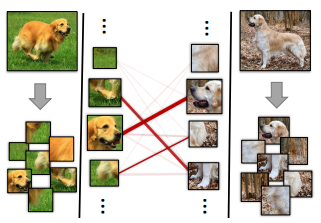
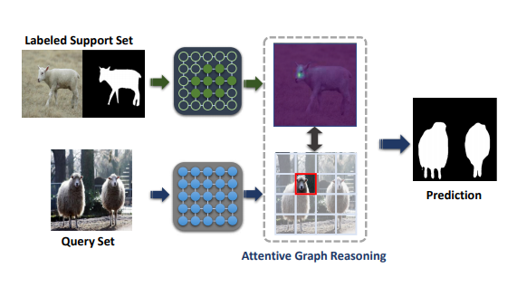
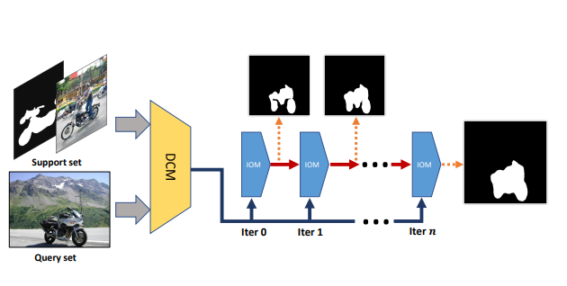

## About Me

I am a Ph.D. candidate, supervised by Prof. Guosheng Lin, at School of Computer Science and Engineering, Nanyang Technological University (NTU), Singapore. I am currently a Research Intern at AI lab, ByteDance. I obtained my bachelor's degree from China University of Mining and Technology (CUMT). I am open to positions in both industries or academia in the future. 

## Research Interests

- **Computer Vision:** image recognition, image segmentation, and other visual understanding tasks.
- **Machine Learning:** few-shot learning, meta-learning, incremental learning, 

## Extracurricular Activities
Besides research, I also participate in many extracurricular activities. I was in Top 8 of Good Voice of Universities 2015 in CUMT. I play football regularly and keep a record of the Dribbling & Shooting test in CUMT. I am a fan of the Football Club of Barcelona. My favourite singers are Jacky Cheung and Freddie Mercury.

## News

- **[Mar. 2021]** One paper is accepted to [CVPR 2021](http://cvpr2021.thecvf.com/).
- **[Oct. 2020]** One paper is accepted to [ACM Multimedia 2020](https://2020.acmmm.org/).
- **[Mar. 2020]** Three papers are accepted to [CVPR 2020](http://cvpr2020.thecvf.com/).
- **[Nov. 2019]** One paper is accepted to [ICCV 2019](https://iccv2019.thecvf.com/).
- **[Mar. 2019]** One paper is accepted to [CVPR 2019](https://cvpr2019.thecvf.com/).
- **[Jan. 2018]** I begin my Ph.D study at NTU.

## Selected Publications

[comment]: <> (fscil.)

  

<strong>Few-Shot Incremental Learning with Continually Evolved Classifiers</strong>
 
<strong>Chi Zhang</strong>,  Nan Song, Guosheng Lin, Yun Zheng, Pan Pan, Yinghui Xu
 
<em>IEEE Conference on Computer Vision and Pattern Recognition. <strong><i style="color:#1e90ff">CVPR 2021</i></strong>.</em>
  

  
   

[comment]: <> (DEEPEMD.)

  

<strong>DeepEMD: Few-Shot Image Classification with Differentiable Earth Mover's Distance and Structured Classifiers</strong>
 
<strong>Chi Zhang</strong>,  Yujun Cai, Guosheng Lin, Chunhua Shen
 
<em>IEEE Conference on Computer Vision and Pattern Recognition. <strong><i style="color:#1e90ff">CVPR 2020</i></strong>.</em>
  
[<a href="https://openaccess.thecvf.com/content_CVPR_2020/papers/Zhang_DeepEMD_Few-Shot_Image_Classification_With_Differentiable_Earth_Movers_Distance_and_CVPR_2020_paper.pdf">PDF</a>] [<a href="https://git.io/DeepEMD">Code</a>]<strong><i style="color:#e74d3c">Oral Presentation</i></strong>

[comment]: <> (pgnet.)

  

<strong>Pyramid Graph Networks with Connection Attentions for Region-Based One-Shot Semantic Segmentation</strong>
 
<strong>Chi Zhang</strong>, Guosheng Lin, Fayao Liu, Jiushuang Guo, Qingyao Wu, Rui Yao
 
<em>IEEE International Conference on Computer Vision. <strong><i style="color:#1e90ff">ICCV 2019</i></strong>.</em>
  
[<a href="https://openaccess.thecvf.com/content_ICCV_2019/papers/Zhang_Pyramid_Graph_Networks_With_Connection_Attentions_for_Region-Based_One-Shot_Semantic_ICCV_2019_paper.pdf">PDF</a>]

[comment]: <> (CANET.)

  

<strong>CANet: Class-Agnostic Segmentation Networks with Iterative Refinement and Attentive Few-Shot Learning</strong>
 
<strong>Chi Zhang</strong>, Guosheng Lin, Fayao Liu, Rui Yao, Chunhua Shen
 
<em>IEEE Conference on Computer Vision and Pattern Recognition. <strong><i style="color:#1e90ff">CVPR 2019</i></strong>.</em>
  
[<a href="https://openaccess.thecvf.com/content_CVPR_2019/papers/Zhang_CANet_Class-Agnostic_Segmentation_Networks_With_Iterative_Refinement_and_Attentive_Few-Shot_CVPR_2019_paper.pdf">PDF</a>] [<a href="https://github.com/icoz69/CaNet">Code</a>]

<!---

- **Few-Shot Incremental Learning with Continually Evolved Classifiers**
   
  **Chi Zhang**, Nan Song, Guosheng Lin, Yun Zheng, Pan Pan, Yinghui Xu
   
  IEEE Conference on Computer Vision and Pattern Recognition. <strong><i style="color:#1e90ff">CVPR 2021</i></strong>.
   

- **DeepEMD: Few-Shot Image Classification with Differentiable Earth Mover's Distance and Structured Classifiers**
   
  **Chi Zhang**, Yujun Cai, Guosheng Lin, Chunhua Shen
   
  IEEE Conference on Computer Vision and Pattern Recognition. <strong><i style="color:#1e90ff">CVPR 2020</i></strong>.
   
  [[PDF](https://openaccess.thecvf.com/content_CVPR_2020/papers/Zhang_DeepEMD_Few-Shot_Image_Classification_With_Differentiable_Earth_Movers_Distance_and_CVPR_2020_paper.pdf)] [[Code](https://git.io/DeepEMD)] <strong><i style="color:#e74d3c">Oral Presentation</i></strong>

- **Pyramid Graph Networks with Connection Attentions for Region-Based One-Shot Semantic Segmentation**
   
  **Chi Zhang**, Guosheng Lin, Fayao Liu, Jiushuang Guo, Qingyao Wu, Rui Yao
   
  IEEE International Conference on Computer Vision. <strong><i style="color:#1e90ff">ICCV 2019</i></strong>.
   
  [[PDF](https://openaccess.thecvf.com/content_ICCV_2019/papers/Zhang_Pyramid_Graph_Networks_With_Connection_Attentions_for_Region-Based_One-Shot_Semantic_ICCV_2019_paper.pdf)] 

- **CANet: Class-Agnostic Segmentation Networks with Iterative Refinement and Attentive Few-Shot Learning**
   
  **Chi Zhang**, Guosheng Lin, Fayao Liu, Rui Yao, Chunhua Shen
   
  IEEE Conference on Computer Vision and Pattern Recognition. <strong><i style="color:#1e90ff">CVPR 2019</i></strong>.
   
  [[PDF](https://openaccess.thecvf.com/content_CVPR_2019/papers/Zhang_CANet_Class-Agnostic_Segmentation_Networks_With_Iterative_Refinement_and_Attentive_Few-Shot_CVPR_2019_paper.pdf)] [[Code](https://github.com/icoz69/CaNet)] 

-->

