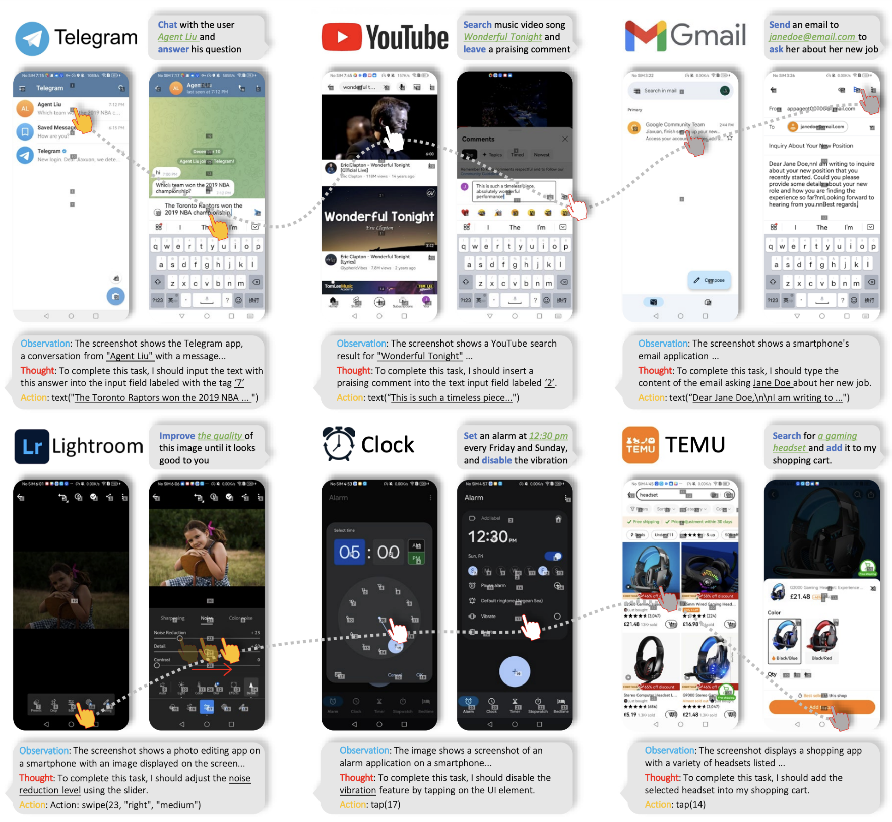

## About Me
I am a scientist at Tencent (Shanghai), working with [Dr. Gang Yu](https://www.skicyyu.org/). I obtained my Ph.D. degree at the School of Computer Science and Engineering, Nanyang Technological University (NTU), Singapore, where I worked under the supervision of [Prof. Guosheng Lin](https://guosheng.github.io/). I also work closely with [Prof. Chunhua Shen](https://cshen.github.io/) and [Prof. Rui Yao](http://faculty.cumt.edu.cn/ruiyao/en/index.htm) in research. I was recognized among [2023 Top 2% Scientists by Stanford University](https://elsevier.digitalcommonsdata.com/datasets/btchxktzyw/6).

I will be joining [Westlake University](https://en.westlake.edu.cn/faculty/chi-zhang.html) as an Assistant Professor (PI) and establish AGI lab in Fall 2024. 
**We have numerous positions available for PhD students, postdoctoral researchers, visiting students, and research assistants. Interested candidates are welcome to email me for inquiries.**

## Research Interests   
My research primarily revolves around vision and learning. At present, I am focusing on the development of large models to solve AI problems. Recent endeavors include  large vision foundation models, multimodal models, and  generative AI models.

## Hobbies
I like singing and was in Top 8 of Good Voice of Universities 2015 in CUMT. I play football regularly. I am a loyal fan of  <del>Football Club of Barcelona</del>  <del> PSG </del> Inter Miami for years. My favorite singers are [张学友](https://zh.wikipedia.org/wiki/%E5%BC%A0%E5%AD%A6%E5%8F%8B) and [Freddie Mercury](https://en.wikipedia.org/wiki/Freddie_Mercury).

## News

<ul>
    <li><strong>[June 2024]</strong> Our work on  <a href="https://arxiv.org/abs/2310.11284">self-supervised 3D scene flow estimation</a> is accepted by TPAMI.</li>
  <li><strong>[June 2024]</strong> 🔥We present <a href="https://buaacyw.github.io/mesh-anything/">MeshAnything</a>, a study on high-quality mesh generation with autoregressive transformers.</li>
  <li><strong>[May 2024]</strong> <a href="https://icoz69.github.io/stablellava-official/">StableLLaVA</a> is accepted by ACL 2024.</li>
  <li><strong>[April 2024]</strong> 🚀We introduce <a href="https://github.com/YvanYin/Metric3D">Metric3D V2</a>, the most capable monocular geometry foundation model for depth and normals estimation. Training codes and demos are available!</li>
  <li><strong>[Mar 2024]</strong> 🚀We introduce <a href="https://deaddawn.github.io/MovieLLM/">MovieLLM</a>, a long-video understanding multimodal LLM.</li>
  <li><strong>[Feb 2024]</strong> <a href="https://buaacyw.github.io/gaussian-editor/">GaussianEditor</a> and <a href="https://arxiv.org/abs/2311.18651">LL3DA</a> are accepted by CVPR2024.</li>
  <li><strong>[Dec 2023]</strong> 🚀🚀🚀We introduce <a href="https://appagent-official.github.io/">AppAgent</a>, a multimodal agent for operating smartphone apps.</li>
  <li><strong>[Dec 2023]</strong> <a href="https://github.com/buaacyw/IT3D-text-to-3D">IT3D</a> is accepted by AAAI 2024.</li>
  <li><strong>[Dec 2023]</strong> We presented <a href="https://icoz69.github.io/facestudio/">FaceStudio</a>, a powerful identity-preserving image synthesis model.</li>
  <li><strong>[Nov 2023]</strong> We presented <a href="https://shapegpt.github.io/">ShapeGPT</a>, a multimodal LLM for 3D shape generation.</li>
  <li><strong>[Nov 2023]</strong> <a href="https://tingxueronghua.github.io/ChartLlama/">ChartLlama</a> is released! It is a powerful LLM for chart understanding and generation.</li>
  <li><strong>[Nov 2023]</strong> We presented <a href="https://buaacyw.github.io/gaussian-editor/">GaussianEditor</a>, a powerful 3D editing algorithm.</li>
  <li><strong>[Oct 2023]</strong> Pleased to be recognized among <a href="https://elsevier.digitalcommonsdata.com/datasets/btchxktzyw/6">2023 Top 2% Scientists by Stanford University</a>.</li>
  <li><strong>[Sept 2023]</strong> We presented <a href="https://arxiv.org/abs/2309.09724">Robust Depth</a> for robust geometry-preserving zero-shot depth estimation, which is accepted by ICCV 2023.</li>
  <li><strong>[Aug 2023]</strong> We presented <a href="https://github.com/buaacyw/IT3D-text-to-3D">IT3D</a>, a plug-and-play to improve the results of 3D AIGC models.</li>
  <li><strong>[Aug 2023]</strong> We have released <a href="https://icoz69.github.io/stablellava-official/">StableLLaVA</a>, a clever strategy for collecting datasets to train multimodal LLMs.</li>
  <li><strong>[Jul. 2023]</strong> Our work, <a href="https://arxiv.org/abs/2307.10984">Metric3D</a>, accepted by ICCV 2023, won first place in the <a href="https://jspenmar.github.io/MDEC/">2nd Monocular Depth Estimation Competition at CVPR</a>.</li>
  <li><strong>[Jul. 2023]</strong> Three papers are accepted to ICCV 2023.</li>
  <li><strong>[May 2023]</strong> We have released <a href="https://arxiv.org/abs/2305.19012">StyleAvatar3D</a>, a work for 3D stylized avatar generation.</li>
</ul>

## Recent Projects

[comment]: <> (meshanything.)

  

<strong>MeshAnything: Artist-Created Mesh Generation with Autoregressive Transformers</strong>
 
Yiwen Chen, Tong He, Di Huang, Weicai Ye, Sijin Chen, Jiaxiang Tang, Xin Chen, Zhongang Cai, Lei Yang, Gang Yu, Guosheng Lin, <strong>Chi Zhang*</strong>
 
<em>Arxiv Preprint <strong><i style="color:#1e90ff"> 2023</i></strong>.</em>
  
  [<a href="https://buaacyw.github.io/mesh-anything/">Project Page</a>][<a href="https://arxiv.org/abs/2406.10163">PDF</a>][<a href="https://github.com/buaacyw/MeshAnything">Code</a>]<iframe src="https://ghbtns.com/github-btn.html?user=buaacyw&repo=MeshAnything&type=star&count=true" frameborder="0" scrolling="0" width="150" height="20" title="GitHub"></iframe>

  

[comment]: <> (stablellava.)

  

<strong>StableLLaVA: Enhanced Visual Instruction Tuning with Synthesized Image-Dialogue Data</strong>
 
Yanda Li*, <strong>Chi Zhang*</strong>, Gang Yu, Zhibin Wang, Bin Fu, Guosheng Lin, Chunhua Shen, Ling Chen, Yunchao Wei
 
<em>Findings of the Association for Computational Linguistics <strong><i style="color:#1e90ff"> ACL 2024</i></strong>.</em>
  
  [<a href="https://icoz69.github.io/stablellava-official/">Project Page</a>][<a href="https://arxiv.org/abs/2308.10253">PDF</a>][<a href="https://github.com/icoz69/StableLLAVA">Code</a>]

  

[comment]: <> (appagent.)

  

<strong>AppAgent: Multimodal Agents as Smartphone Users</strong>
 
<strong>Chi Zhang*</strong>, Zhao Yang*, Jiaxuan Liu*, Yuchen Han, Xin Chen, Zebiao Huang, Bin Fu, Gang Yu
 
<em>Arxiv Preprint <strong><i style="color:#1e90ff"> 2023</i></strong>.</em>
  
  [<a href="https://appagent-official.github.io/">Project Page</a>][<a href="https://arxiv.org/abs/2312.13771">PDF</a>][<a href="https://github.com/mnotgod96/AppAgent">Code</a>] <iframe src="https://ghbtns.com/github-btn.html?user=mnotgod96&repo=AppAgent&type=star&count=true" frameborder="0" scrolling="0" width="150" height="20" title="GitHub"></iframe>

  

[comment]: <> (gaussianeditor.)

  

<strong>GaussianEditor: Swift and Controllable 3D Editing with Gaussian Splatting</strong>
 
Yiwen Chen, Zilong Chen, <strong>Chi Zhang</strong>, Feng Wang, Xiaofeng Yang, Yikai Wang, Zhongang Cai, Lei Yang, Huaping Liu, Guosheng Lin
 
<em>IEEE Conference on Computer Vision and Pattern Recognition <strong><i style="color:#1e90ff"> CVPR 2024</i></strong>.</em>
  
[<a href="https://buaacyw.github.io/gaussian-editor/">Project Page</a>][<a href="https://arxiv.org/abs/2311.14521">PDF</a>][<a href="https://github.com/buaacyw/GaussianEditor">Code</a>]

  

[comment]: <> (LL3DA.)

  

<strong>LL3DA: Visual Interactive Instruction Tuning for Omni-3D Understanding, Reasoning, and Planning.</strong>
 
Sijin Chen, Xin Chen, <strong>Chi Zhang</strong>, Mingsheng Li, Gang Yu, Hao Fei, Hongyuan Zhu, Jiayuan Fan, Tao Chen
 
<em>IEEE Conference on Computer Vision and Pattern Recognition <strong><i style="color:#1e90ff"> CVPR 2024</i></strong>.</em>
  
[<a href="https://ll3da.github.io/">Project Page</a>][<a href="https://arxiv.org/abs/2311.18651">PDF</a>][<a href="https://github.com/Open3DA/LL3DA">Code</a>]

  

[comment]: <> (it3d.)

  

<strong>IT3D: Improved Text-to-3D Generation with Explicit View Synthesis</strong>
 
Yiwen Chen, <strong>Chi Zhang*</strong>, Xiaofeng Yang, Zhongang Cai, Gang Yu, Lei Yang, Guosheng Lin
 
<em>AAAI Conference on Artificial Intelligence  <strong><i style="color:#1e90ff"> AAAI2024</i></strong>.</em>
  
[<a href="https://arxiv.org/abs/2308.11473">PDF</a>][<a href="https://github.com/buaacyw/IT3D-text-to-3D">Code</a>]

  

[comment]: <> (chartllama.)

  

<strong>ChartLlama: A Multimodal LLM for Chart Understanding and Generation</strong>
 
Yucheng Han*, <strong>Chi Zhang*</strong>, Xin Chen, Xu Yang, Zhibin Wang, Gang Yu, Bin Fu, Hanwang Zhang
 
<em>Arxiv Preprint <strong><i style="color:#1e90ff"> 2023</i></strong>.</em>
  
  [<a href="https://tingxueronghua.github.io/ChartLlama/">Project Page</a>][<a href="https://arxiv.org/abs/2311.16483">PDF</a>][<a href="https://github.com/tingxueronghua/ChartLlama-code">Code</a>]

  

[comment]: <> (styleavatar.)

  

<strong>StyleAvatar3D: Leveraging Image-Text Diffusion Models for High-Fidelity 3D Avatar Generation</strong>
 
<strong>Chi Zhang</strong>, Yiwen Chen, Yijun Fu, Zhenglin Zhou, Gang YU, Billzb Wang, Bin Fu, Tao Chen, Guosheng Lin, Chunhua Shen
 
<em>Arxiv Preprint <strong><i style="color:#1e90ff"> 2023</i></strong>.</em>
  
[<a href="https://arxiv.org/abs/2305.19012">PDF</a>][<a href="https://github.com/icoz69/StyleAvatar3D">Code</a>]

  

[comment]: <> (facestudio.)

  

<strong>FaceStudio: Put Your Face Everywhere in Seconds</strong>
 
Yuxuan Yan*, <strong>Chi Zhang*</strong>, Rui Wang, Yichao Zhou, Gege Zhang, Pei Cheng, Bin Fu, Gang Yu
 
<em>Arxiv Preprint <strong><i style="color:#1e90ff"> 2023</i></strong>.</em>
  
  [<a href="https://icoz69.github.io/facestudio/">Project Page</a>][<a href="https://arxiv.org/abs/2312.02663">PDF</a>][<a href="https://github.com/xyynafc/FaceStudio">Code</a>]

  

[comment]: <> (metric3d.)

  

<strong>Metric3D: Towards Zero-shot Metric 3D Prediction from A Single Image</strong>
 
Wei Yin*, <strong>Chi Zhang*</strong>, Hao Chen, Zhipeng Cai, Gang Yu, Kaixuan Wang, Xiaozhi Chen, Chunhua Shen
 
<em>IEEE International Conference on Computer Vision  <strong><i style="color:#1e90ff"> ICCV 2023</i></strong>.</em>
  
[<a href="https://arxiv.org/abs/2307.10984">PDF</a>][<a href="https://github.com/YvanYin/Metric3D">Code</a>]

  

[comment]: <> (robust.)

  

<strong>Robust Geometry-Preserving Depth Estimation Using Differentiable Rendering</strong>
 
<strong>Chi Zhang</strong>, Wei Yin, Gang Yu, Zhibin Wang, Tao Chen, Bin Fu, Joey Tianyi Zhou, Chunhua Shen
 
<em>IEEE International Conference on Computer Vision  <strong><i style="color:#1e90ff"> ICCV 2023</i></strong>.</em>
  
[<a href="https://arxiv.org/abs/2309.09724">PDF</a>]

  

[comment]: <> (ShapeGPT.)

  

<strong>ShapeGPT: 3D Shape Generation with A Unified Multi-modal Language Model</strong>
 
Fukun Yin, Xin Chen, <strong>Chi Zhang</strong>, Biao Jiang, Zibo Zhao, Jiayuan Fan, Gang Yu, Taihao Li, Tao Chen
 
<em>Arxiv Preprint <strong><i style="color:#1e90ff"> 2023</i></strong>.</em>
  
[<a href="https://shapegpt.github.io/">Project Page</a>][<a href="https://arxiv.org/abs/2311.17618">PDF</a>][<a href="https://github.com/OpenShapeLab/ShapeGPT">Code</a>]

  

<!---

comment

-->
 
 
 

