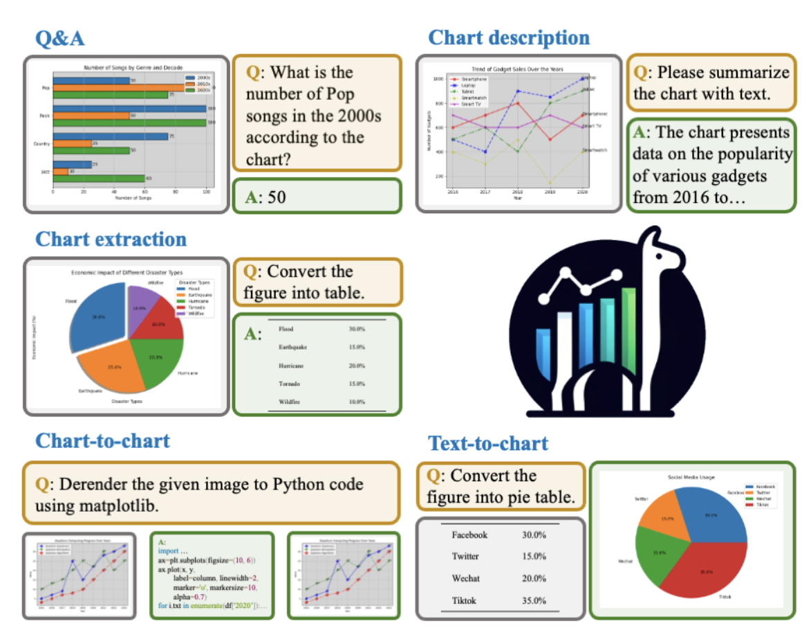
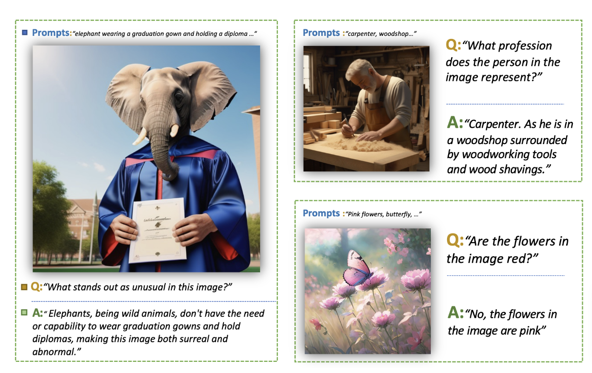
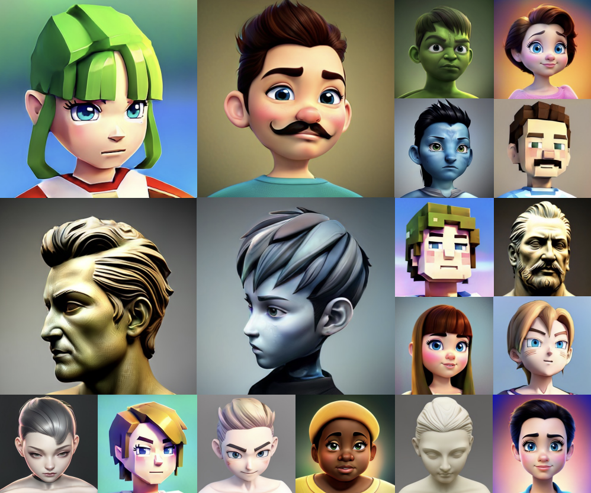
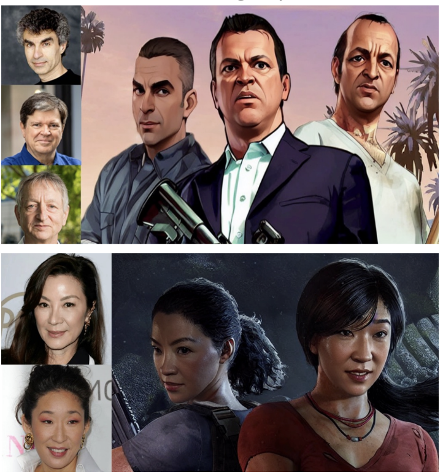
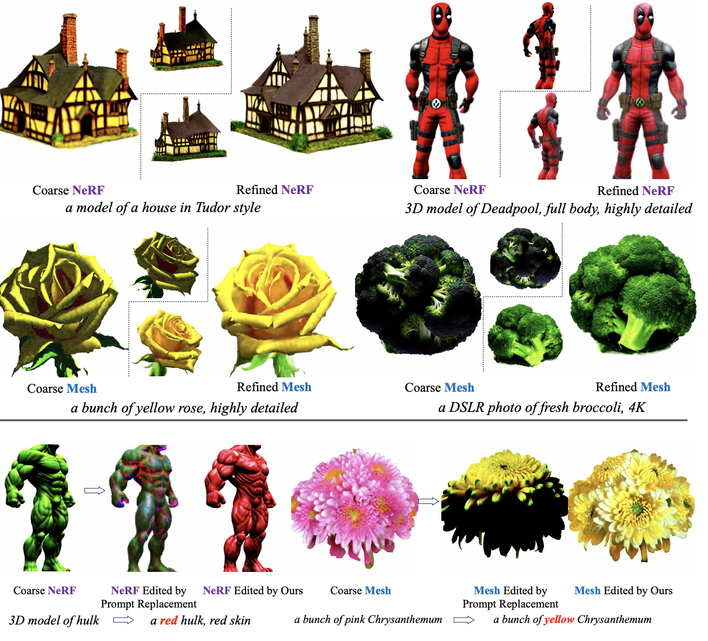
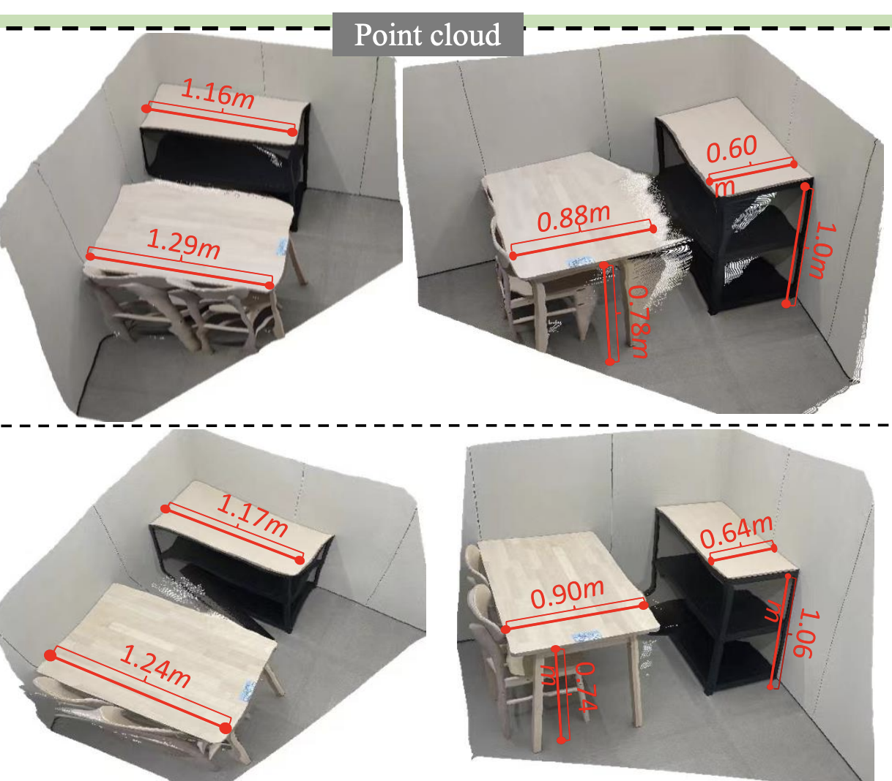
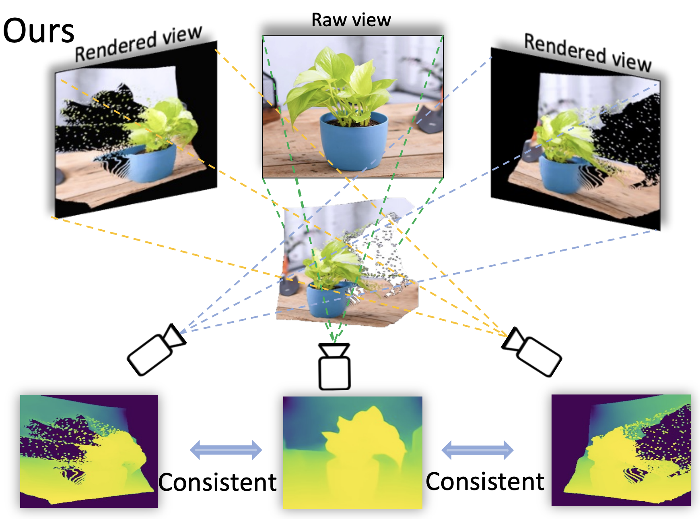
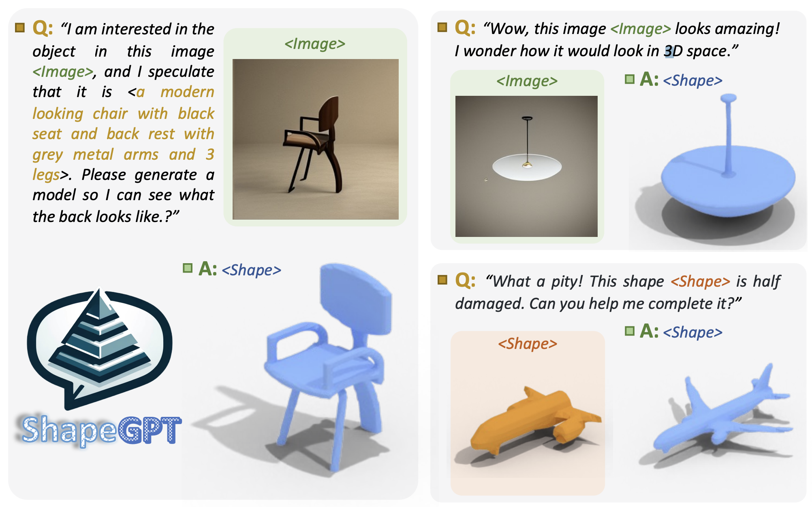
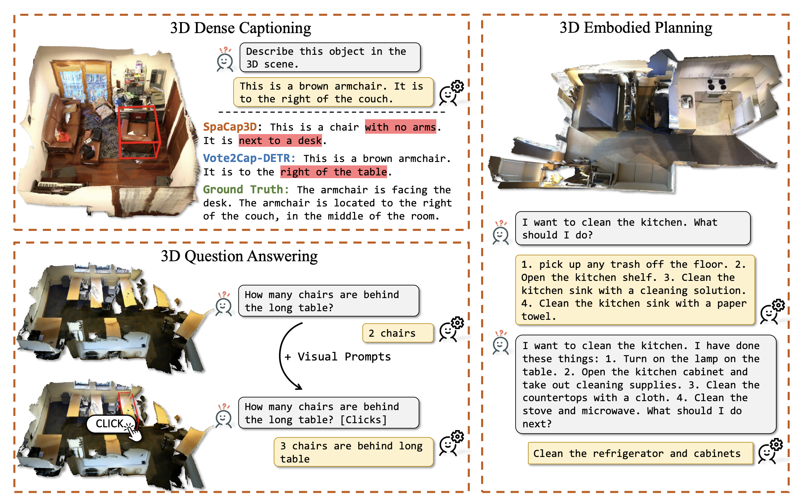

## About Me
I am a scientist at Tencent, working with Dr. Gang Yu. I obtained my Ph.D. degree at the School of Computer Science and Engineering, Nanyang Technological University (NTU), Singapore, where I worked under the supervision of Prof. Guosheng Lin. After graduation, I joined Tencent（through 腾讯技术大咖 program）. I also work closely with Prof. Chunhua Shen and Prof. Rui Yao in research. 

**I currently have internship positions available with the goal of conducting cutting-edge research in artificial intelligence. If you are interested, please send me an email.**

## Research Interests
My research primarily revolves around vision and learning.

**At present, I am focusing on the development of large models. Recent endeavors include  large zero-shot depth estimation models ([HDN](https://openreview.net/pdf?id=BNqRpzwyOFU), [Robust Depth](https://arxiv.org/abs/2309.09724) and [Metric3D](https://arxiv.org/abs/2307.10984)), multimodal large language models ([StableLLaVA](https://icoz69.github.io/stablellava-official/),[ChartLlama](https://tingxueronghua.github.io/ChartLlama/),[ShapeGPT](https://shapegpt.github.io/), [LL3DA](https://arxiv.org/abs/2311.18651) ), and  2D/3D generative models ([StyleAvatar3D](https://arxiv.org/abs/2305.19012), [IT3D](https://github.com/buaacyw/IT3D-text-to-3D), [GaussianEditor](https://buaacyw.github.io/gaussian-editor/), [FaceStudio](https://icoz69.github.io/facestudio/)).**

## Hobbies
I like singing and was in Top 8 of Good Voice of Universities 2015 in CUMT. I play football regularly. I am a loyal fan of  <del>Football Club of Barcelona</del>  <del> PSG </del> Inter Miami. My favorite singers are 张学友 and Freddie Mercury.

## News
- **[Dec 2023]** [IT3D](https://github.com/buaacyw/IT3D-text-to-3D) is accepted by [AAAI 2024](https://aaai.org/aaai-conference/).
- **[Dec 2023]** We presented [FaceStudio](https://icoz69.github.io/facestudio/), a powerful identity-preserving image synthesis model.
- **[Nov 2023]** We presented [ShapeGPT](https://shapegpt.github.io/), a multimodal LLM for 3D shape generation.
- **[Nov 2023]** [ChartLlama](https://tingxueronghua.github.io/ChartLlama/) is released!  It is a powerful LLM for chart understanding and generation.
- **[Nov 2023]** We presented [GaussianEditor](https://buaacyw.github.io/gaussian-editor/), a powerful 3D editing algorithm.
- **[Sept 2023]** We presented [Robust Depth](https://arxiv.org/abs/2309.09724) for robust geometry-preserving zero-shot depth estimation, which is accepted by [ICCV 2023](https://iccv2023.thecvf.com/). 
- **[Aug 2023]** We presented [IT3D](https://github.com/buaacyw/IT3D-text-to-3D), a plug-and-play to improve the results of 3D AIGC models.
- **[Aug 2023]** We have released [StableLLaVA](https://icoz69.github.io/stablellava-official/), a clever strategy for collecting datasets to train multimodal LLMs.
- **[Jul. 2023]** Our work, [Metric3D](https://arxiv.org/abs/2307.10984), accpeted by [ICCV 2023](https://iccv2023.thecvf.com/),  won first place in the  [2nd Monocular Depth Estimation Competition at CVPR](https://jspenmar.github.io/MDEC/) .
- **[Jul. 2023]** Three papers are accepted to [ICCV 2023](https://iccv2023.thecvf.com/). 
- **[May 2023]** We have released [StyleAvatar3D](https://arxiv.org/abs/2305.19012), a work for 3D stylized avatar generation.

## Recent Projects
[comment]: <> (chartllama.)

  

<strong>ChartLlama: A Multimodal LLM for Chart Understanding and Generation</strong>
 
Yucheng Han*, <strong>Chi Zhang*</strong>, Xin Chen, Xu Yang, Zhibin Wang, Gang Yu, Bin Fu, Hanwang Zhang
 
<em>Arxiv Preprint <strong><i style="color:#1e90ff"> 2023</i></strong>.</em>
  
  [<a href="https://tingxueronghua.github.io/ChartLlama/">Project Page</a>][<a href="https://arxiv.org/abs/2311.16483">PDF</a>][<a href="https://github.com/tingxueronghua/ChartLlama-code">Code</a>]

  

[comment]: <> (stablellava.)

  

<strong>StableLLaVA: Enhanced Visual Instruction Tuning with Synthesized Image-Dialogue Data</strong>
 
Yanda Li*, <strong>Chi Zhang*</strong>, Gang Yu, Zhibin Wang, Bin Fu, Guosheng Lin, Chunhua Shen, Ling Chen, Yunchao Wei
 
<em>Arxiv Preprint <strong><i style="color:#1e90ff"> 2023</i></strong>.</em>
  
  [<a href="https://icoz69.github.io/stablellava-official/">Project Page</a>][<a href="https://arxiv.org/abs/2308.10253">PDF</a>][<a href="https://github.com/icoz69/StableLLAVA">Code</a>]

  

[comment]: <> (styleavatar.)

  

<strong>StyleAvatar3D: Leveraging Image-Text Diffusion Models for High-Fidelity 3D Avatar Generation</strong>
 
<strong>Chi Zhang</strong>, Yiwen Chen, Yijun Fu, Zhenglin Zhou, Gang YU, Billzb Wang, Bin Fu, Tao Chen, Guosheng Lin, Chunhua Shen
 
<em>Arxiv Preprint <strong><i style="color:#1e90ff"> 2023</i></strong>.</em>
  
[<a href="https://arxiv.org/abs/2305.19012">PDF</a>][<a href="https://github.com/icoz69/StyleAvatar3D">Code</a>]

  

[comment]: <> (facestudio.)

  

<strong>FaceStudio: Put Your Face Everywhere in Seconds</strong>
 
Yuxuan Yan*, <strong>Chi Zhang*</strong>, Rui Wang, Yichao Zhou, Gege Zhang, Pei Cheng, Bin Fu, Gang Yu
 
<em>Arxiv Preprint <strong><i style="color:#1e90ff"> 2023</i></strong>.</em>
  
  [<a href="https://icoz69.github.io/facestudio/">Project Page</a>][<a href="https://arxiv.org/abs/2312.02663">PDF</a>][<a href="https://github.com/xyynafc/FaceStudio">Code</a>]

  

[comment]: <> (it3d.)

  

<strong>IT3D: Improved Text-to-3D Generation with Explicit View Synthesis</strong>
 
Yiwen Chen, <strong>Chi Zhang*</strong>, Xiaofeng Yang, Zhongang Cai, Gang Yu, Lei Yang, Guosheng Lin
 
<em>AAAI Conference on Artificial Intelligence  <strong><i style="color:#1e90ff"> AAAI2024</i></strong>.</em>
  
[<a href="https://arxiv.org/abs/2308.11473">PDF</a>][<a href="https://github.com/buaacyw/IT3D-text-to-3D">Code</a>]

  

[comment]: <> (gaussianeditor.)

  

<strong>GaussianEditor: Swift and Controllable 3D Editing with Gaussian Splatting</strong>
 
Yiwen Chen, Zilong Chen, <strong>Chi Zhang</strong>, Feng Wang, Xiaofeng Yang, Yikai Wang, Zhongang Cai, Lei Yang, Huaping Liu, Guosheng Lin
 
<em>Arxiv Preprint <strong><i style="color:#1e90ff"> 2023</i></strong>.</em>
  
[<a href="https://buaacyw.github.io/gaussian-editor/">Project Page</a>][<a href="https://arxiv.org/abs/2311.14521">PDF</a>][<a href="https://github.com/buaacyw/GaussianEditor">Code</a>]

  

[comment]: <> (metric3d.)

  

<strong>Metric3D: Towards Zero-shot Metric 3D Prediction from A Single Image</strong>
 
Wei Yin*, <strong>Chi Zhang*</strong>, Hao Chen, Zhipeng Cai, Gang Yu, Kaixuan Wang, Xiaozhi Chen, Chunhua Shen
 
<em>IEEE International Conference on Computer Vision  <strong><i style="color:#1e90ff"> ICCV 2023</i></strong>.</em>
  
[<a href="https://arxiv.org/abs/2307.10984">PDF</a>][<a href="https://github.com/YvanYin/Metric3D">Code</a>]

  

[comment]: <> (robust.)

  

<strong>Robust Geometry-Preserving Depth Estimation Using Differentiable Rendering</strong>
 
<strong>Chi Zhang</strong>, Wei Yin, Gang Yu, Zhibin Wang, Tao Chen, Bin Fu, Joey Tianyi Zhou, Chunhua Shen
 
<em>IEEE International Conference on Computer Vision  <strong><i style="color:#1e90ff"> ICCV 2023</i></strong>.</em>
  
[<a href="https://arxiv.org/abs/2309.09724">PDF</a>]

  

[comment]: <> (ShapeGPT.)

  

<strong>ShapeGPT: 3D Shape Generation with A Unified Multi-modal Language Model</strong>
 
Fukun Yin, Xin Chen, <strong>Chi Zhang</strong>, Biao Jiang, Zibo Zhao, Jiayuan Fan, Gang Yu, Taihao Li, Tao Chen
 
<em>Arxiv Preprint <strong><i style="color:#1e90ff"> 2023</i></strong>.</em>
  
[<a href="https://shapegpt.github.io/">Project Page</a>][<a href="https://arxiv.org/abs/2311.17618">PDF</a>][<a href="https://github.com/OpenShapeLab/ShapeGPT">Code</a>]

  

[comment]: <> (LL3DA.)

  

<strong>LL3DA: Visual Interactive Instruction Tuning for Omni-3D Understanding, Reasoning, and Planning.</strong>
 
Sijin Chen, Xin Chen, <strong>Chi Zhang</strong>, Mingsheng Li, Gang Yu, Hao Fei, Hongyuan Zhu, Jiayuan Fan, Tao Chen
 
<em>Arxiv Preprint <strong><i style="color:#1e90ff"> 2023</i></strong>.</em>
  
[<a href="https://ll3da.github.io/">Project Page</a>][<a href="https://arxiv.org/abs/2311.18651">PDF</a>][<a href="https://github.com/Open3DA/LL3DA">Code</a>]

  

<!---

comment

-->
 
 
 

